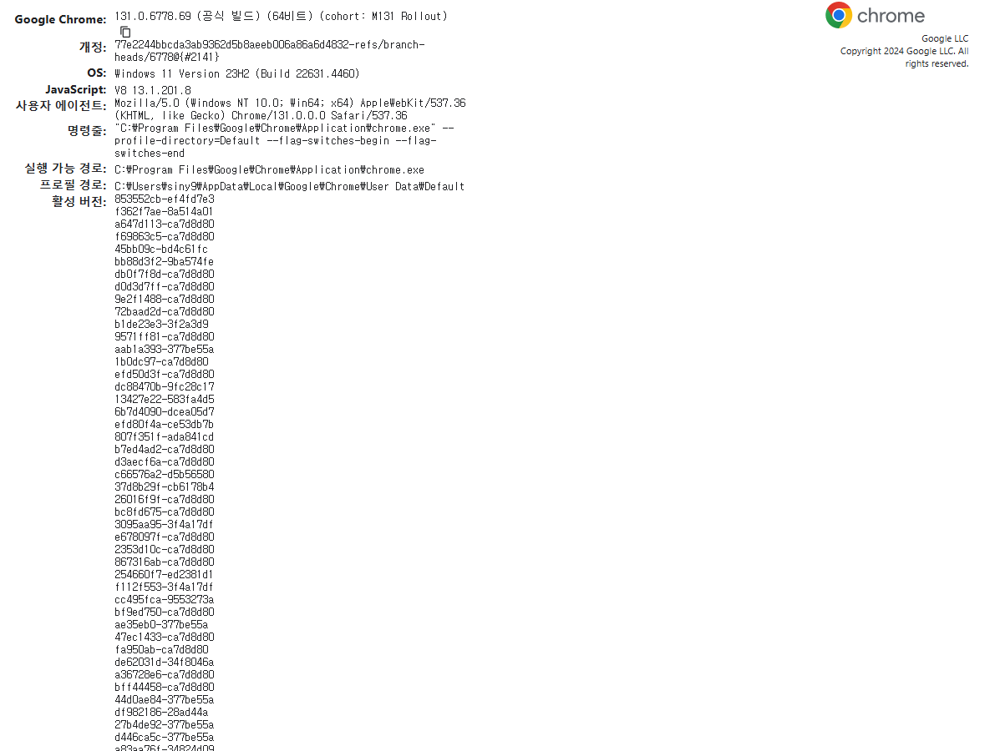

JAVA 크롤링 관련 게시글
https://velog.io/@minjiki2/%ED%81%AC%EB%A1%A4%EB%A7%81-Java%EB%A1%9C-%EC%9B%B9-%ED%81%AC%EB%A1%A4%EB%A7%81%ED%95%98%EA%B8%B0-Jsoup

Jsoup을 이용하면 간단하게 크롤링을 해서 내가 원하는 정보를 가져 올 수 있지만 웹 페이지가 여러 api또는 script로 동적으로 데이터를 불러오는 경우에는 Jsoup으로는 크롤링이 불가능하다.
이럴 경우에는 Selenium을 이용해 동적으로 크롤링을 하면 된다.

Selenium 동적웹 크롤링
https://velog.io/@rednada1486/Java-Selenium-%ED%99%9C%EC%9A%A9-%EB%8F%99%EC%A0%81%EC%9B%B9%ED%81%AC%EB%A1%A4%EB%A7%81

내가 현재 사용하고 있는 크롬 버전 확인
크롬 Url입력 창에 chrome://version 치면 사용하고 있는 버전이 나온다

https://chromedriver.chromium.org/downloads 에서 크롬 버전에 맞는 드라이버 다운로드

